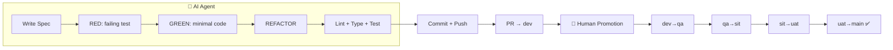

# Agentic Demo

> AI-Driven Full-Loop Engineering — Clone → Config → Loop

[](https://github.com/tuit2542/agentic-demo/actions/workflows/ci.yml)

---

## What Is This?

Starter kit สำหรับให้ **AI agent** (agy / Claude Code / Codex / Hermes) ทำ full development loop เอง: 从 spec → TDD → code → validate → commit → push → PR → dev แล้ว human ค่อย promotion ต่อ

**ไม่ต้อง install อะไรเพิ่ม** — แค่ clone + config + สั่ง AI

## Quick Start (3 นาที)

```bash
# 1. Clone
git clone https://github.com/tuit2542/agentic-demo.git my-project
cd my-project

# 2. Setup
./scripts/setup.sh

# 3. สั่ง AI
agy -p "$(cat docs/AI_PROMPT_TEMPLATE.md)" --dangerously-skip-permissions
# หรือ claude / codex / Hermes ได้หมด

# ดูคู่มือเต็ม
cat docs/BOOTSTRAP.md
```

## Tech Stack

| Layer | Stack |
|-------|-------|
| Backend | Python 3.11, FastAPI, Pydantic v2, uvicorn |
| Frontend | Next.js, React, TypeScript, Tailwind CSS |
| Testing | pytest (backend), vitest (frontend) |
| Lint | ruff (backend), eslint (frontend) |
| Type | mypy (backend), tsc (frontend) |
| CI | GitHub Actions |

## What The Loop Does



## For AI Agents

1. Read `AGENTS.md` — project rules + commands
2. Read `.hermes/specs/TEMPLATE.md` — write feature spec
3. Copy `docs/AI_PROMPT_TEMPLATE.md` → paste to AI agent
4. AI does: RED → GREEN → REFACTOR → validate → commit → PR
5. Human: promote dev → qa → sit → uat → main

## Project Structure

```
agentic-demo/
├── AGENTS.md                  ← กฎโปรค — AI อ่านทุกครั้ง
├── .hermes.md                 ← monorepo rules
├── backend/
│   ├── .hermes.md             ← backend rules
│   ├── src/                   ← code
│   ├── tests/                 ← tests
│   ├── scripts/               ← validation
│   └── requirements.txt
├── frontend/
│   ├── .hermes.md             ← frontend rules
│   ├── src/                   ← code
│   └── package.json
├── .hermes/specs/
│   ├── TEMPLATE.md            ← spec template
│   └── *.md                   ← feature specs
├── docs/
│   ├── BOOTSTRAP.md           ← คู่มือ setup สำหรับคนอื่น
│   ├── AI_PROMPT_TEMPLATE.md  ← copy ไปสั่ง AI ได้เลย
│   ├── WORKFLOW.md            ← Mermaid flowchart
│   └── TRACKING.md            ← checklist
└── scripts/
    └── setup.sh               ← one-click setup
```

## Quality Gates (AI ทำก่อน commit ทุกครั้ง)

| Gate | Backend | Frontend |
|------|---------|----------|
| Lint | `ruff check` | ESLint |
| Type | mypy | tsc |
| Test | pytest | vitest |

## Branching

```
feat/* → dev → qa → sit → uat → main
   ↑ AI ทำถึง dev
   ↑ Human ค่อย promote ต่อ
```

## Docs

- **[คู่มือ setup สำหรับคนอื่น](docs/BOOTSTRAP.md)** — 3 ขั้นตอนจบ
- **[AI Prompt Template](docs/AI_PROMPT_TEMPLATE.md)** — copy + paste สั่ง AI ได้เลย
- **[Workflow](docs/WORKFLOW.md)** — flowchart Mermaid

## License

MIT
