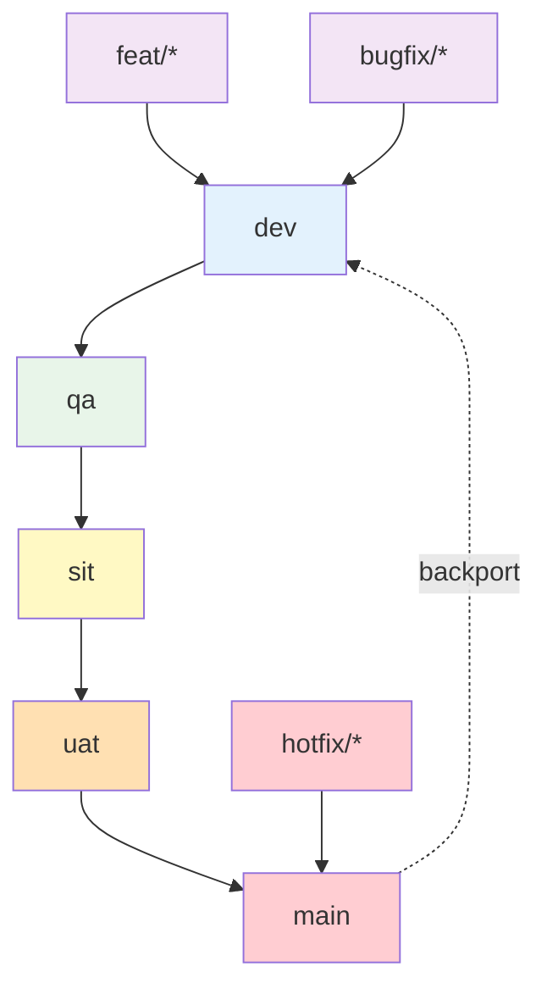
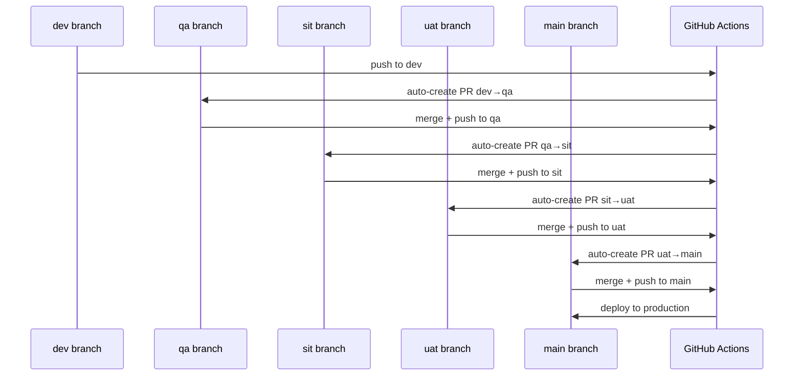

# Documentation Index

> Agentic Demo — URL Shortener

---

## Quick Links

| Document | Description | When to Read |
|----------|-------------|--------------|
| [API.md](API.md) | API endpoints, models, store | Implementing features |
| [WORKFLOW.md](WORKFLOW.md) | TDD flow, branching, promotion | Starting new work |
| [SETUP.md](SETUP.md) | Project setup, GitHub, CI | First time setup |
| [CHANGELOG.md](CHANGELOG.md) | Version history | Checking what changed |
| [HANDOFF.md](HANDOFF.md) | Context for new AI session | New AI session |
| [.hermes.md](../.hermes.md) | Project rules (agent reads this) | Every task |

---

## Flow Diagrams

### Development Flow

```mermaid
graph LR
    A[Spec] --> B[Best Practices]
    B --> C[Plan]
    C --> D[TDD: RED→GREEN→REFACTOR]
    D --> E[Validate]
    E --> F[Commit]
    F --> G[Push]
    G --> H[Create PR]
    H --> I[CI: lint+type+test+security]
    I --> J[Review]
    J --> K[Merge]
    K --> L[Auto-Promote]
    L --> M[Auto-Deploy]
    
    style A fill:#e1f5fe
    style K fill:#c8e6c9
    style M fill:#fff3e0
```

### Branching Strategy

### Auto-Promote Flow

---

## Project Status

- **Stack:** Python 3.11, FastAPI, Pydantic v2
- **Tests:** 16 passing
- **Validation:** lint + type + test + security (warn-only)
- **Branches:** main → uat → sit → qa → dev → feat/*
- **Auto:** promote + deploy on merge

---

*Last updated: 2026-08-27*