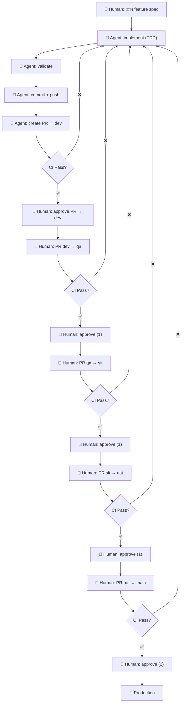
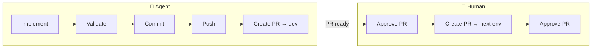

# Development Workflow

> Flow ปัจจุบันของ Agentic Demo — Agent ทำ code, Human approve + promote

---

## Overview



---

## Responsibility Split

| Phase | Agent | Human |
|-------|:-----:|:-----:|
| Design (spec) | - | ✅ |
| Implement (TDD) | ✅ | - |
| Validate (lint/type/test) | ✅ | - |
| Commit + push | ✅ | - |
| Create PR → dev | ✅ | - |
| Approve PR | - | ✅ |
| Promote ข้าม env | - | ✅ |

---

## Branch Protection Rules

| Branch | Required Approvals | CI Required |
|--------|:------------------:|:-----------:|
| dev | 0 | ✅ |
| qa | 1 | ✅ |
| sit | 1 | ✅ |
| uat | 1 | ✅ |
| main | 2 | ✅ |

---

## Agent Workflow (สิ่งที่ Agent ทำ)

```bash
# 1. Implement
# TDD: RED → GREEN → REFACTOR

# 2. Validate
cd backend && python scripts/pre_commit_validate.py
cd frontend && python scripts/validate.py

# 3. Commit + push
git add -A
git commit -m "feat: feature-name"
git push -u origin HEAD

# 4. Create PR
gh pr create --title "feat: feature-name" --body "..." --base dev

# DONE — agent ไม่ต้องทำอะไรต่อ
```

---

## Human Workflow (สิ่งที่ Human ทำ)

```bash
# 1. Approve PR → dev (GitHub UI)
# 2. Create PR dev → qa
gh pr create --title "promote: dev → qa" --base qa --head dev
# 3. Approve PR qa → sit (1 approval)
# 4. Create PR sit → uat
# 5. Approve PR uat → main (2 approvals)
```

---

## Diagram แยก Agent vs Human



---

*Last updated: 2026-08-31*
